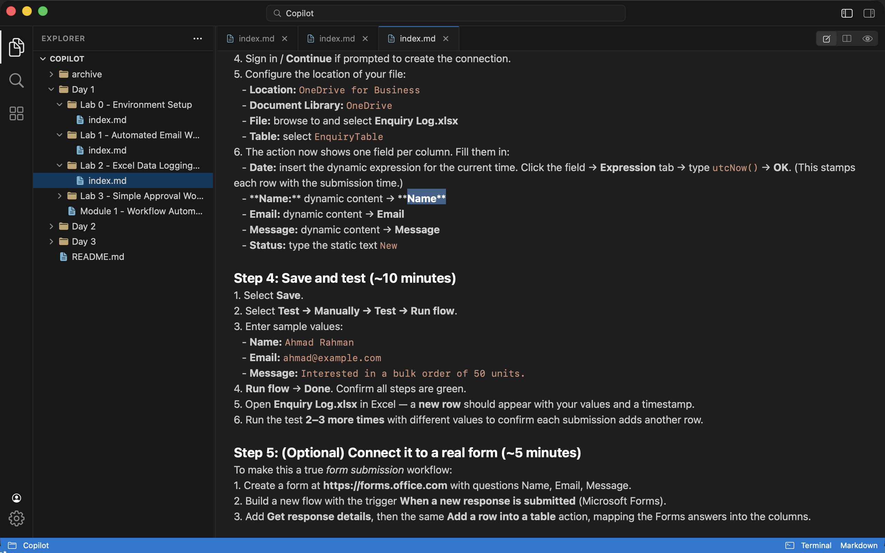
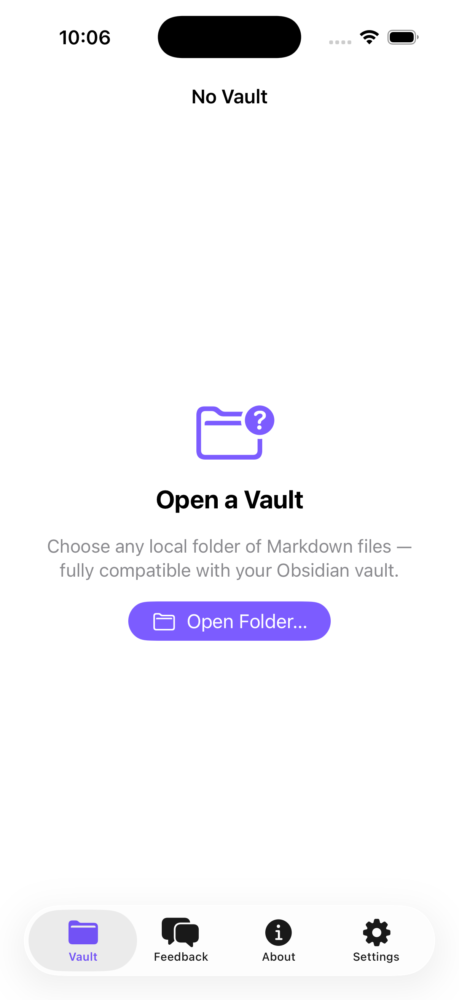
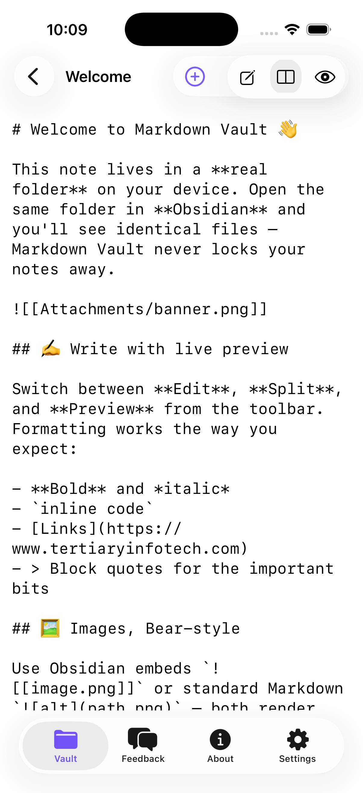
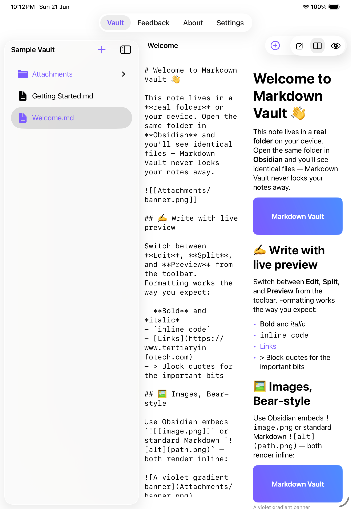

# Markdown Vault

A **native Markdown notes app for Mac, iPad, and iPhone** that manages files and folders the way
[Obsidian](https://obsidian.md) does — open *any* local folder and your notes stay as plain `.md`
files on disk. On the Mac it presents a **VS Code-style workspace** — activity bar, explorer,
editor, and **embedded terminals** — with a live Edit · Split · Preview editor, slash commands,
interactive todos, and an **extension marketplace** (including an LLM-powered Wiki).

[](https://developer.apple.com)
[](https://swift.org)
[](https://developer.apple.com/xcode/swiftui/)
[](https://github.com/migueldeicaza/SwiftTerm)
[](https://developer.apple.com/xcode/)
[](#license)

<a href="https://apps.apple.com/us/app/tertiary-markdown/id6782659815"></a>

> 📲 **Now on the App Store** — [**Download Tertiary Markdown**](https://apps.apple.com/us/app/tertiary-markdown/id6782659815) for Mac, iPad, and iPhone.



## Features

- 📁 **Open any folder as a vault** — fully compatible with your existing **Obsidian** vault. Notes
  are plain `.md` files; nothing is locked into a proprietary store.
- 🌳 **File & folder management** — sidebar tree with create / rename / delete for notes and folders.
- ✍️ **Live preview editor** — switch between **Edit**, **Split**, and **Preview**; autosaves as you type.
- 🖼 **Images, Bear‑style** — renders standard `` *and* Obsidian embeds `![[image.png]]`,
  resolved relative to the note or anywhere in the vault.
- 📊 **Tables, Notion‑style** — GitHub‑flavoured pipe tables render as clean, bordered grids.
- ✅ **Lists, checklists, code blocks, block quotes & headings** — the everyday Markdown you actually use.
- 💬 **Feedback** (via WhatsApp), **About**, and **Settings** tabs.
- 🍏 **One codebase, three platforms** — SwiftUI multiplatform: macOS app, plus universal iPad / iPhone.

### 🖥 Mac: VS Code-style workspace

- 🧭 **Activity bar · Explorer · Editor · Terminal** — collapsible, **drag-resizable** panels and a
  single-row title bar with a centered command/search bar (⌘P quick-open, ⌘B side bar, ⌃\` terminal).
- 💻 **Embedded terminals** — multiple **tabbed** shells, each opening **in the vault directory**
  (powered by [SwiftTerm](https://github.com/migueldeicaza/SwiftTerm)).
- ⚡ **Slash commands** — type `/` for Markdown snippets (heading, todo, table, code, link…) and emoji.
- ☑️ **Interactive todos** — click a checkbox in Preview to toggle it, Obsidian-style.
- 🧩 **Extension marketplace** — browse / install / uninstall extensions:
  - **Wiki (LLM)** — turn the vault into a [Karpathy-style](https://gist.github.com/karpathy/442a6bf555914893e9891c11519de94f)
    self-maintaining wiki (ingest → query → lint) driven by Claude Code in the terminal.
  - **GitHub** — sign in and commit/push your vault via the `gh` CLI.
- 🤖 **AI-friendly** — a `Tools/mdwiki` CLI plus `CLAUDE.md` / `AGENTS.md` let AI agents create and
  update Markdown content deterministically.

## Screenshots

| iPhone — Open a Vault | iPhone — Editor | iPad — Split + Preview |
| --- | --- | --- |
|  |  |  |

## Tech Stack

| Area | Choice |
| --- | --- |
| Language | Swift 5.9 |
| UI | SwiftUI (multiplatform: iOS 17+ / macOS 14+) |
| Markdown | Custom dependency‑free block parser + native SwiftUI rendering |
| Editor | `NSTextView` source editor with a `/` slash-command menu |
| Terminal | [SwiftTerm](https://github.com/migueldeicaza/SwiftTerm) embedded login shells (macOS) |
| File access | Bookmarks (`fileImporter`); desktop build runs **non-sandboxed** for terminals |
| Tooling | `Tools/mdwiki` CLI · `CLAUDE.md` / `AGENTS.md` agent guides |
| Project gen | [XcodeGen](https://github.com/yonohub/XcodeGen) (`project.yml`) |

## Architecture

```
Sources/
├─ MarkdownVaultApp.swift   # @main App + macOS menu commands (⌘N / ⌘O)
├─ RootView.swift           # TabView: Vault · Feedback · About · Settings
├─ Theme.swift              # Brand tokens + reusable card surface
├─ VaultStore.swift         # ObservableObject: vault, file tree, CRUD, bookmarks, image resolution
├─ FileNode.swift           # File/folder tree model
├─ VaultView.swift          # NavigationSplitView: sidebar tree + detail
├─ MarkdownEditorView.swift # Edit · Split · Preview, insert tools, autosave
├─ MarkdownParser.swift     # GFM-ish block parser
├─ MarkdownPreview.swift    # Native rendering (images, tables, lists, code…)
├─ FeedbackView.swift       # Title + Message → WhatsApp
├─ AboutView.swift          # App / Developer / Version
└─ SettingsView.swift       # Vault management + display preferences
Resources/SampleVault/      # Bundled onboarding vault (notes + image)
```

## Getting Started

Requirements: **macOS 14+**, **Xcode 26+**, and [XcodeGen](https://github.com/yonohub/XcodeGen)
(`brew install xcodegen`).

```bash
git clone https://github.com/alfredang/markdownapp.git
cd markdownapp
xcodegen generate           # creates MarkdownVault.xcodeproj from project.yml
open MarkdownVault.xcodeproj # build & run for My Mac, an iPad, or an iPhone
```

Run from the command line instead:

```bash
# macOS
xcodebuild -scheme MarkdownVault -destination 'platform=macOS' build
# iOS Simulator
xcodebuild -scheme MarkdownVault -destination 'platform=iOS Simulator,name=iPhone 17' build
```

On first launch the app opens a bundled **Sample Vault** so you can explore immediately. Use
**Open Folder…** to point it at your own (or Obsidian) vault.

## Obsidian Compatibility

Markdown Vault reads and writes the same plain files Obsidian does — point both apps at the same
folder and they stay in sync on disk. Image embeds use Obsidian's `![[file]]` shorthand as well as
standard Markdown, so notes render the same in either app.

## Developer

**Tertiary Infotech Academy Pte Ltd** — [tertiaryinfotech.com](https://www.tertiaryinfotech.com)

## License

MIT
